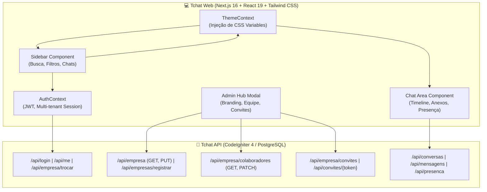

# 💻 Tchat Web — WhatsApp Corporativo Web & Plataforma Multi-tenant (White-label)

[](https://nextjs.org/)
[](https://react.dev/)
[](https://tailwindcss.com/)
[](https://www.typescriptlang.org/)
[](#-arquitetura-e-decisões-de-engenharia)
[](LICENSE)

O **Tchat Web** é uma solução de comunicação corporativa web desenvolvida sobre o ecossistema moderno do **Next.js 16 (App Router & Turbopack)**, **React 19** e **Tailwind CSS 4**. Inspirada na experiência intuitiva do **WhatsApp Web**, a aplicação foi desenhada para operar como uma plataforma **SaaS B2B Multi-tenant com White-label dinâmico em tempo de execução**.

O projeto resolve uma das maiores dores de segurança e conformidade das empresas: a dispersão de conversas de trabalho em mensageiros pessoais. Ao centralizar as trocas de mensagens em um ambiente privativo e isolado, o Tchat Web entrega uma experiência corporativa segura com controle estrito de acessos (RBAC), presença em tempo real e capacidade de personalização visual completa da marca da empresa contratante.

---

## 💼 Caso de Negócio & Proposta de Valor

| Desafio Corporativo | Solução Implementada no Tchat Web |
| :--- | :--- |
| **Vazamento e mistura de dados pessoais e profissionais** | **Ambiente 100% isolado por empresa**: Colaboradores apenas visualizam e conversam com membros ativos da sua organização. |
| **Falta de governança no desligamento de funcionários** | **Revogação de acesso em tempo real**: O desligamento ou suspensão pelo painel administrativo encerra a sessão web instantaneamente. |
| **Identidade visual genérica** | **White-label dinâmico via CSS Variables**: Administradores configuram cores primária/secundária e logotipo, transformando a interface em tempo real. |
| **Profissionais com atuação em múltiplas empresas** | **Multi-tenancy nativo com chaveamento rápido**: Alternância fluida de ambiente corporativo sem necessidade de logout. |
| **Diferenciação clara de permissões** | **Controle RBAC nativo**: Colaboradores utilizam interface focada em chat; Administradores têm acesso ao hub de branding e gestão de equipe. |

---

## 🎯 Funcionalidades Principais

### 1. 💬 Experiência Completa estilo WhatsApp Web
* **Layout em Duas Colunas (Split Pane)**:
  * **Sidebar Esquerda (380px–420px)**:
    * Cabeçalho corporativo com foto de perfil, tag da empresa conectada, crachá de cargo (`ADMIN` ou `Colaborador`) e menu de ações.
    * Barra de busca instantânea (filtro por nome do contato, grupo ou conteúdo da mensagem) e botão de filtro para mensagens não lidas.
    * Lista de conversas com contador visual de mensagens não lidas na cor da marca, carimbos temporais (*Hoje*, *Ontem*, datas) e snippets inteligentes para fotos e documentos.
  * **Painel de Chat Ativo (Direita)**:
    * **Tela de espera elegante (Empty State)**: Ilustração com logotipo e nome da empresa ativa e selo de segurança corporativa.
    * **Cabeçalho da conversa**: Avatar do colaborador/grupo, status de presença em tempo real (*online* pulsante ou *offline*) e ações.
    * **Timeline de mensagens**: Fundo texturizado clássico do WhatsApp, balões confortáveis (verde para enviados, branco para recebidos), suporte a ampliação de imagens via lightbox, download de arquivos anexados e tiques duplos azuis de leitura.
    * **Barra de digitação**: Auto-crescimento do campo de texto, atalhos de envio (`Enter` para enviar e `Shift+Enter` para quebra de linha), upload de arquivos e fotos com prévia e cancelamento rápido.

### 2. 🎨 Motor White-Label & Theming Dinâmico (Exclusivo para Administradores)
* **Painel Administrativo Completo (`AdminSettingsModal`)**:
  * **Aba "Visual e Marca"**:
    * Alteração da Razão Social e Nome Fantasia da organização.
    * **Seletores de Cor Primária e Secundária**: Color pickers HTML5 visuais, inputs hexadecimais diretos e paletas corporativas pré-configuradas (*TechCorp*, *InovaLog*, *WhatsApp*, *Índigo*, *Executivo*, *Ardósia*, etc.).
    * Input de URL do Logotipo institucional com pré-visualização instantânea.
    * **Simulador ao Vivo**: Exibição em tempo real de como a barra superior, os balões de conversa e os botões de ação se comportarão antes de salvar.
    * Persistência atômica no banco de dados via `PUT /api/empresa` com injeção instantânea de CSS Variables (`--primary-color`, `--secondary-color`, `--primary-hover`, `--primary-contrast`), alterando todo o sistema sem recarregar a página.
  * **Aba "Colaboradores"**:
    * Gestão completa da equipe com listagem de membros ativos, inativos e suspensos.
    * Alteração ágil de cargos (`admin`, `gerente`, `colaborador`) via `PATCH /api/empresa/colaboradores/{id}/cargo`.
    * Alteração de status com trava de proteção contra auto-desativação do administrador logado.
  * **Aba "Convites Corporativos"**:
    * Emissão de convites por e-mail ou telefone (`POST /api/empresa/convites`) com validade de 7 dias.
    * Cópia do link direto de convite (`/convite/[token]`) com 1 clique.
    * Cancelamento de convites pendentes.

### 3. 🟢 Presença e Sincronização em Tempo Real
* **Heartbeat de Presença**: Batimento periódico a cada 30 segundos (`POST /api/presenca/ping`) mantendo o colaborador como *online*.
* **Desconexão Otimizada**: Envio de beacon no ciclo de encerramento da aba (`window.addEventListener('beforeunload')` via `navigator.sendBeacon`) para marcar o usuário como *offline* de forma instantânea.
* **Polling Inteligente**: Verificação contínua de novas mensagens a cada 2.5s no chat ativo e atualização da lista lateral a cada 6s.

### 4. 🌐 Fluxos de Onboarding e Páginas Públicas
* **Login Corporativo (`/login`)**: Interface moderna com botões de preenchimento rápido (Demo) para contas de Administrador e Colaborador de diferentes empresas.
* **Cadastro de Nova Empresa (`/registrar-empresa`)**: Onboarding self-service que cria o ambiente corporativo, define as cores iniciais da marca e gera o primeiro administrador (`POST /api/empresas/registrar`).
* **Aceite de Convites (`/convite/[token]`)**: Página que carrega dinamicamente a identidade visual da empresa emissora antes do aceite, permitindo ao convidado definir suas credenciais e ingressar imediatamente no time.

---

## 🏛️ Arquitetura e Decisões de Engenharia



### 🧠 Destaques de Arquitetura & Boas Práticas

1. **Zero-Trust Multi-Tenancy**: O frontend nunca passa parâmetros manipuláveis como `?empresa_id=X` para autorização. Todo o escopo do tenant é resolvido de forma estrita no token JWT assinado (`firebase/php-jwt`). Ao alternar de empresa, um novo token é emitido e todas as listas de conversas são reiniciadas limpas.
2. **Cálculo Matemático de Contraste (Acessibilidade WCAG)**: As cores escolhidas pelo administrador passam por um algoritmo de luminância relativa (`getContrastTextColor`), calculando automaticamente se os textos de botões e badges devem ser claros (`#FFFFFF`) ou escuros (`#0F172A`), garantindo 100% de legibilidade independentemente da paleta escolhida.
3. **Resiliência a Desconexões e Revogações**: Os interceptors do Axios capturam respostas `401` ou `403` emitidas quando um membro tem seu vínculo desativado em tempo real pelo administrador, limpando a sessão e redirecionando para a tela de login.
4. **Turbopack & React 19 Compiler Ready**: Projeto 100% tipado com TypeScript em modo estrito, sem uso de `any`, em total conformidade com o compilador do React 19 e o empacotador Turbopack do Next.js 16.

---

## 📂 Estrutura de Pastas do Projeto

```
src/
├── app/
│   ├── layout.tsx                     # Layout raiz com fontes Geist e wrappers Auth/Theme
│   ├── page.tsx                       # Tela principal estilo WhatsApp Web (Sidebar + Chat)
│   ├── globals.css                    # Estilos globais, scrollbars finas e padrão WhatsApp
│   ├── login/
│   │   └── page.tsx                   # Tela de login corporativo com botões demo
│   ├── registrar-empresa/
│   │   └── page.tsx                   # Cadastro de nova empresa e seu administrador
│   └── convite/
│       └── [token]/
│           └── page.tsx               # Aceite de convite corporativo com visual dinâmico
├── components/
│   ├── Chat/
│   │   ├── ChatHeader.tsx             # Topo do chat com nome, foto e status online em tempo real
│   │   ├── MessageArea.tsx            # Scroll de mensagens, fundo texturizado e lightbox
│   │   ├── MessageBubble.tsx          # Balão de chat (texto, fotos, anexos e tiques azuis)
│   │   ├── ChatInput.tsx              # Input auto-ajustável, anexos de arquivos e atalho Enter
│   │   └── EmptyChatState.tsx         # Tela inicial de boas-vindas com branding da empresa
│   ├── Sidebar/
│   │   ├── SidebarHeader.tsx          # Topo da sidebar com dados do usuário, tag da empresa e ações
│   │   ├── SearchBar.tsx              # Busca instantânea e alternador de filtro de não lidas
│   │   ├── ConversationList.tsx       # Lista de conversas com scroll otimizado e estados vazios
│   │   └── ConversationItem.tsx       # Item individual com badges na cor primária e snippets
│   └── Modals/
│       ├── AdminSettingsModal.tsx     # Hub Administrativo: Branding (Visual), Membros e Convites
│       ├── NewChatModal.tsx           # Modal para conversa direta ou criação de grupos
│       ├── ProfileModal.tsx           # Visualização de dados e upload de foto de avatar
│       └── CompanySwitchModal.tsx     # Alternador de empresa para usuários multi-tenant
├── contexts/
│   ├── AuthContext.tsx                # Contexto de autenticação, persistência e troca de empresa
│   └── ThemeContext.tsx               # Motor de injeção de CSS variables e paleta da empresa
├── services/
│   └── api.ts                         # Cliente Axios com interceptors de token e revogação
├── types/
│   └── index.ts                       # Tipagem TypeScript estrita (User, Empresa, Conversa, Mensagem)
└── utils/
    ├── colors.ts                      # Funções matemáticas de cores (RGB, luminância, contraste)
    └── formatters.ts                  # Formatação de datas (Hoje, Ontem), telefones e tamanhos
```

---

## 🧪 Usuários de Teste e Demonstração (Seed Data)

Para facilitar a avaliação técnica e visual do projeto, o banco de dados da API conta com colaboradores e empresas de teste pré-configurados:

| Empresa | Colaborador | Telefone | Senha | Cargo | Identidade Padrão |
| :--- | :--- | :--- | :--- | :--- | :--- |
| **TechCorp Soluções** | Ana Silva | `5511999990001` | `123456` | **Administrador** | Azul Marinho (`#0A4D68`) |
| **TechCorp Soluções** | Bruno Souza | `5511999990002` | `123456` | **Colaborador** | Azul Marinho (`#0A4D68`) |
| **TechCorp Soluções** | Carla Mendes | `5511999990003` | `123456` | **Colaborador** | Azul Marinho (`#0A4D68`) |
| **InovaLog Logística** | Diego Santos | `5511999990004` | `123456` | **Administrador** | Verde Musgo (`#1E5128`) |
| **InovaLog Logística** | Elena Rocha | `5511999990005` | `123456` | **Colaborador** | Verde Musgo (`#1E5128`) |

### 💡 Roteiro Rápido para Avaliação do Portfólio

1. **Teste do White-Label em Tempo Real**:
   * Faça login com **Ana Silva** (`5511999990001` / `123456`).
   * Observe que o sistema carrega a identidade visual azul da **TechCorp**.
   * Clique no ícone de configurações (**Sliders**) no topo da barra lateral.
   * Na aba **"Visual e Marca"**, selecione uma nova cor primária (ou escolha um preset rápido como *Vinho Bordô* ou *Índigo*).
   * Clique em **"Salvar Identidade Visual da Empresa"**: toda a aplicação (cabeçalhos, botões, badges, destaques) assumirá o novo visual imediatamente.
2. **Teste de Permissões RBAC (Colaborador Comum)**:
   * Saia e faça login com **Bruno Souza** (`5511999990002` / `123456`).
   * Observe que o ícone de configurações de administração **não é exibido** na interface, mantendo a experiência focada estritamente na comunicação corporativa.
3. **Teste de Multi-tenancy Estrito**:
   * Faça login com **Diego Santos** da **InovaLog** (`5511999990004` / `123456`).
   * Observe a identidade visual verde musgo e verifique que apenas os colaboradores e conversas da InovaLog são visíveis, comprovando o isolamento de dados entre empresas.

---

## 🛠️ Tecnologias e Ferramentas Utilizadas

* **Framework**: Next.js 16.3 (App Router, Turbopack)
* **Linguagem**: TypeScript 5.0+
* **Biblioteca de UI**: React 19.2
* **Estilização**: Tailwind CSS v4 com CSS Custom Properties
* **Ícones**: Lucide React
* **Cliente HTTP**: Axios com Interceptors
* **Backend de Integração**: Tchat API (PHP 8.2+ / CodeIgniter 4 / PostgreSQL 16)

---

## 💻 Instalação e Execução Local

### Pré-requisitos
* Node.js 20+ e npm
* Backend **Tchat API** rodando em `http://localhost:8080` (ou porta configurada)

### 1. Clonar o Repositório e Instalar Dependências
```bash
git clone https://github.com/seu-usuario/tchat-web.git
cd tchat-web
npm install
```

### 2. Configurar as Variáveis de Ambiente (`.env.local`)
Crie um arquivo `.env.local` na raiz do projeto (opcional, padrão aponta para localhost):
```env
NEXT_PUBLIC_API_URL=http://localhost:8080/api
```

### 3. Executar o Servidor de Desenvolvimento
```bash
npm run dev
```
Acesse a aplicação em `http://localhost:3000`.

### 4. Build de Produção e Verificação de Tipos
```bash
npm run build
npm run lint
```

---

## 👨‍💻 Autor & Portfólio

Projeto desenvolvido como solução de alta fidelidade em engenharia de software frontend, demonstrando arquitetura multi-tenant, design de sistemas corporativos, theming dinâmico em tempo de execução e integração avançada com APIs RESTful.
